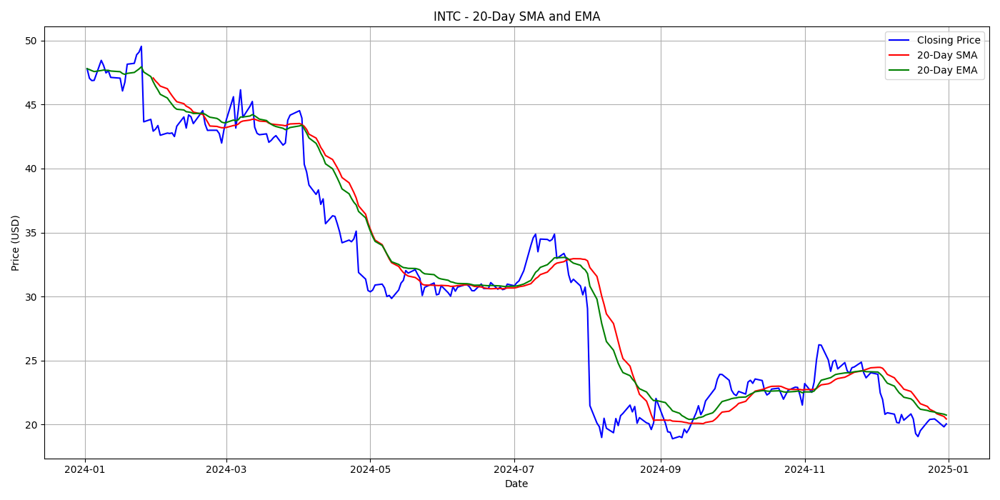
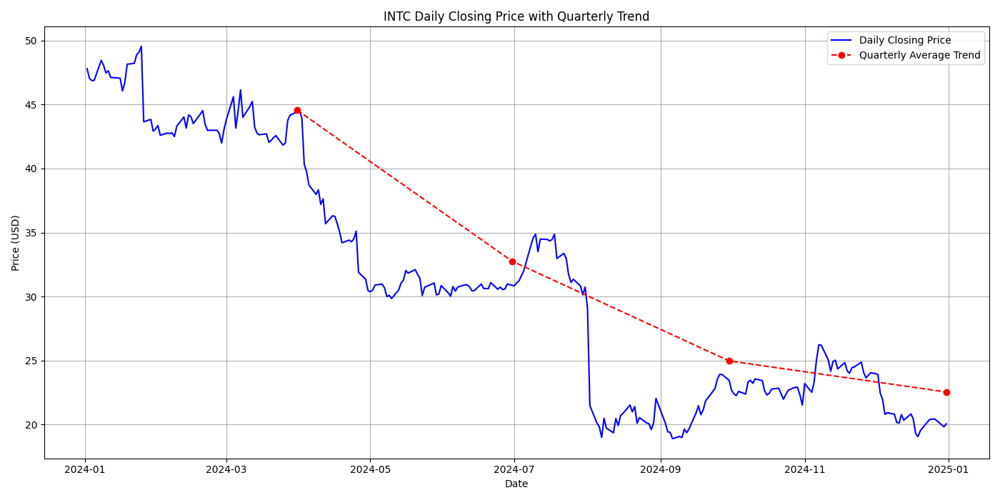
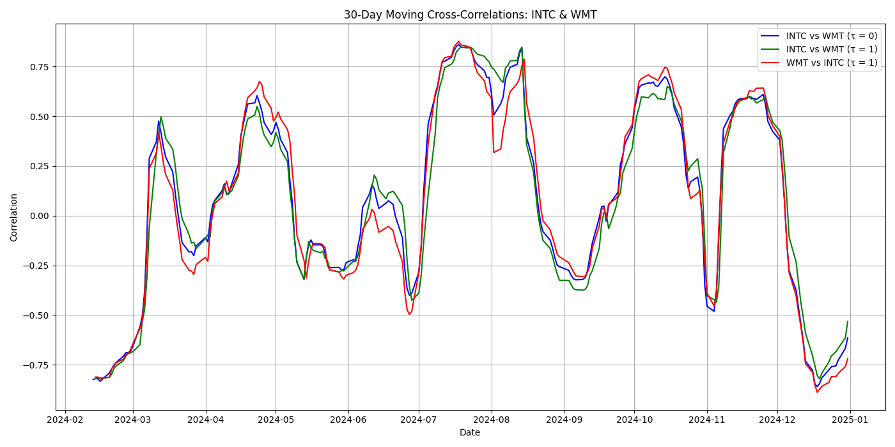

# Time Series Analysis & Visualization of Stock Prices

### Background

This project performs exploratory time series analysis on stock price data from **Yahoo Finance** for **Intel Corporation (INTC)** and **Walmart Inc. (WMT)** over the past year. The goal is to apply key statistical techniques to identify trends, visualize patterns, and explore inter-stock relationships to support data-driven investment insights.

---

### Project Components

### 1. **Moving Averages Analysis (INTC)**

- Download daily closing prices of INTC for the past year.
- Compute and visualize the **20-day Simple Moving Average (SMA)** and **20-day Exponential Moving Average (EMA)**.
- Plot the moving averages alongside the original price to analyze trend direction and price volatility.
- **Interpretation**:
    - **SMA** smooths price fluctuations and is useful for identifying medium-term trends.
    - **EMA** responds more quickly to recent price changes and is useful for short-term trend detection.

### 2. **Quarterly Trend Analysis (INTC)**

- Aggregate daily prices by fiscal quarter and compute the **average closing price** per quarter.
- Plot the quarterly trend line overlaid with the daily price chart.
- **Interpretation**:
    - The quarterly trend reveals medium-term direction and helps identify sustained uptrends, downtrends, or potential turning points.

### 3. **Cross-Stock Correlation Analysis (INTC vs WMT)**

- Download daily closing prices for INTC and WMT for the same time period.
- Compute **30-day moving window cross-correlations** under different lag conditions:
    - **τ = 0**: INTC vs WMT (synchronous correlation)
    - **τ = 1**: INTC leads WMT by 1 day
    - **τ = -1**: WMT leads INTC by 1 day
- **Interpretation**:
    - Reveals co-movement patterns and potential lead-lag relationships between the two stocks, which are valuable for portfolio diversification and predictive modeling.

---

### Tech Stack

- **Data Source**: Yahoo Finance
- **Language**: Python
- **Libraries**: `pandas`, `matplotlib`, `yfinance`, `numpy`

---

### 📈Application Value

This project demonstrates how to leverage time series analysis techniques—such as moving averages, quarterly aggregation, and rolling correlations—for stock price analysis. It serves as a practical template for financial analytics, investment research, and market trend exploration.
